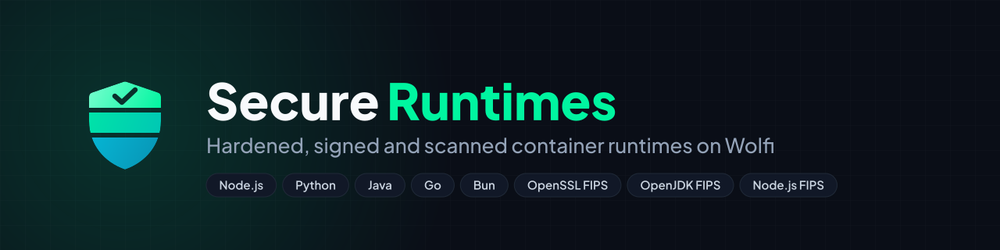

<p align="center"></p>

# High-Assurance Secure Container Runtimes

[](https://github.com/taha2samy-3/node)
[](https://github.com/chainguard-dev)
[](https://github.com/taha2samy-3/node/actions)
[](LICENSE)

A collection of **enterprise-grade, zero-CVE, FIPS 140-3 compliant container base images** built upon [Chainguard's Wolfi OS](https://github.com/chainguard-dev) undistro. Designed for zero-trust security postures, regulated industries (FedRAMP, DoD, HIPAA, PCI-DSS), and high-security microservice architectures.

---

## 🌟 Supported Runtimes & Flavors

| Runtime | Versions | Flavors Available | FIPS 140-3 Compliant | Base OS |
| :--- | :--- | :--- | :---: | :--- |
| **OpenJDK** | `8`, `17`, `21`, `25` (LTS) | `dev`, `standard`, `distroless` | ✅ | Wolfi Linux + BCFIPS |
| **OpenSSL** | `3.5.5` | `dev`, `standard`, `distroless` | ✅ | Wolfi Linux + FIPS Module |
| **Node.js FIPS** | `22`, `24` | `dev`, `standard`, `distroless` | ✅ | Wolfi Linux + OpenSSL FIPS Module |
| **Node.js** | `18`, `20`, `22`, `24`, `26` | `dev`, `prod` | Optional | Wolfi Linux |
| **Go** | `1.22`, `1.23`, `1.24` | `dev`, `prod` | Optional | Wolfi Linux |
| **Python** | `3.10`, `3.11`, `3.12`, `3.13`, `3.14` | `dev`, `prod` | Optional | Wolfi Linux |
| **Bun** | `1` | `dev`, `prod` | Optional | Wolfi Linux |

---

## 🛡️ Security Architecture & Controls

### 1. Zero-CVE Foundation
All images are built directly on Wolfi Linux, a declarative Linux undistro optimized for container security:
- **Zero Shell / Distroless:** Production containers (`prod` / `distroless`) ship with **no shell (`sh`/`bash`)** and **no package manager (`apk`)**.
- **Non-Root Execution:** All production runtime targets execute strictly under non-privileged UID/GID `65532:65532`.
- **Rapid Patching:** Wolfi rolling packages remediate upstream CVEs within hours of public disclosure.

### 2. Strict FIPS 140-3 Enforcement
- **[OpenJDK FIPS](openjdk/README.md):** Powered by **Eclipse Adoptium OpenJDK 8, 17, 21 and 25** and **Bouncy Castle FIPS** (`bc-fips`, `bcpkix-fips`, `bctls-fips`). Overrides JVM security configuration (`conf/security/java.security`) to force BCFIPS as Provider 1, BCFKS as default keystore, and SP 800-90A DRBG entropy.
- **[OpenSSL FIPS](openssl/README.md):** Built from source with `--enable-fips`. Strict `openssl.cnf` policy locks down legacy algorithms (MD5, DES, 3DES, RC4) and permits only approved cryptographic mechanisms.
- **Node.js FIPS:** Wolfi's Node.js links the system OpenSSL, which loads the validated OpenSSL FIPS 3.1.2 provider from the OpenSSL FIPS image. `fips=yes` is the default property and `--force-fips` (via `NODE_OPTIONS`) stops application code from calling `crypto.setFips(false)`, so MD5, ChaCha20 and RSA-1024 are rejected. Every build runs `/usr/share/nodejs-fips/fips-check.js` and fails if FIPS mode is not enforced.

### 3. Supply Chain Security (SLSA Level 3)
- **SLSA Provenance:** Cryptographically signed attestations generated via GitHub Actions OIDC and published to the GitHub Container Registry (GHCR).
- **CycloneDX SBOMs:** Every image contains a machine-readable Software Bill of Materials (SBOM) generated in CycloneDX JSON format.
- **Continuous Scanning:** Integrated Trivy vulnerability scanning, CIS Docker benchmark audits, and license compliance checks.

---

## 🚀 Quick Start

### Pulling from GHCR

```bash
# OpenJDK 21 FIPS (Production Distroless)
docker pull ghcr.io/taha2samy-3/wolfi-openjdk-fips:21-distroless

# OpenSSL 3.5 FIPS (Production Distroless)
docker pull ghcr.io/taha2samy-3/openssl-fips:3.5.5-distroless

# Node.js 22 (Production)
docker pull ghcr.io/taha2samy-3/node:22

# Node.js 24 FIPS (Production Distroless)
docker pull ghcr.io/taha2samy-3/node-fips:24-distroless
```

---

## 🛠️ Building with Docker Bake

This repository utilizes Docker Buildx Bake (`docker-bake.hcl`) for multi-platform, declarative container builds:

```bash
# Build all OpenJDK FIPS targets (8, 17, 21, 25), or a single one
docker buildx bake openjdk
docker buildx bake openjdk-21-prod

# Build all OpenSSL FIPS targets
docker buildx bake openssl-dev openssl-standard openssl-prod

# Build all Node.js targets
docker buildx bake dev-22 prod-22

# Build all Node.js FIPS targets (needs the OpenSSL FIPS image)
docker buildx bake node-fips

# Build the entire default group across all runtimes
docker buildx bake
```

---

## 🧪 Testing & Verification

Each runtime module includes automated test suites validating cryptographic compliance and runtime stability:

```bash
# Run OpenJDK FIPS automated tests against a JDK and a JRE image
cd openjdk
pytest tests/ -v --jdk-img ghcr.io/taha2samy-3/wolfi-openjdk-fips:21-dev --jre-img ghcr.io/taha2samy-3/wolfi-openjdk-fips:21

# Run OpenSSL FIPS automated tests
cd openssl
pytest tests/tests/ -v

# Check that a Node.js FIPS image enforces FIPS mode
docker run --rm ghcr.io/taha2samy-3/node-fips:24-distroless /usr/share/nodejs-fips/fips-check.js
```

---

## 🔁 Per-Image Builds and Scans

Every change rebuilds, re-attests, rescans and republishes on the dashboard **only the images it affects**:

1. `.github/scripts/plan_images.py` gives every bake target a fingerprint: its resolved bake definition, the Dockerfile stages it builds, the local files those stages copy, and the fingerprints of images it consumes (Node.js FIPS consumes the OpenSSL FIPS image).
2. **Build and Push Images** compares that fingerprint with the `io.github.taha2samy-3.build.fingerprint` label of the published image and rebuilds only targets that differ or are not published yet. A build that failed or was cancelled is retried on the next run.
3. **Generate Security Dashboard and Deploy** scans only the rebuilt images (plus any image without a stored report) and keeps the last reports of everything else, which are published with the site under `reports/`.

Examples: bumping `NODE_22_FULL_VERSION` rebuilds `node:22`, `node:22-dev` and `node-fips:22*`; editing `openjdk/conf/java-8.security` rebuilds the three Java 8 images; editing a README rebuilds nothing.

Both workflows can be run by hand: **Build and Push Images** takes `rebuild` (`changed`, `all`, or ids such as `node-22 openjdk`) and the dashboard workflow takes `rescan` (`missing`, `all`, or ids).

---

## 📊 Security & Compliance Dashboard

The repository includes a modern web-based compliance dashboard built with React, Vite, and Tailwind-inspired styling located under `web/`:

```bash
cd web
npm install
npm run dev
```

The dashboard displays:
- Real-time vulnerability posture and CVE breakdown.
- FIPS 140-3 cryptographic boundary inspection (Bouncy Castle & OpenSSL providers).
- CIS benchmark pass/fail scores.
- Interactive SBOM package explorer.
- SLSA provenance attestation links.

---

## 📁 Repository Structure

```
├── .github/
│   ├── workflows/
│   │   ├── build.yml         # CI: Multi-platform container build & attestation pipeline
│   │   └── docs.yml          # CI: Security scans, CIS benchmarks, and documentation
│   └── scripts/plan_images.py # Decides which images to build, attest and scan
├── openjdk/                  # Wolfi OpenJDK FIPS 140-3 module
│   ├── dockerfile            # Multi-stage Wolfi + BCFIPS build
│   ├── docker-bake.hcl       # Standalone OpenJDK bake targets
│   ├── conf/java-<v>.security # Hardened FIPS 140-3 security policy per Java version
│   ├── render_security.py    # Renders conf/java-<v>.security from templates/
│   ├── tests/                # Automated pytest & JUnit verification suite
│   ├── benchmark/            # Cryptographic benchmark scripts
│   └── README.md             # OpenJDK module documentation
├── nodejs/                   # Node.js images (regular + FIPS stages)
│   ├── dockerfile            # dev / prod and fips-dev / fips-standard / fips-distroless
│   └── fips/                 # OpenSSL FIPS config and the build-time FIPS check
├── openssl/                  # Wolfi OpenSSL FIPS 140-3 module
│   ├── dockerfile            # Source build with enable-fips
│   ├── docker-bake.hcl       # Standalone OpenSSL bake targets
│   ├── conf/openssl.cnf      # Hardened FIPS provider configuration
│   ├── tests/                # Pytest FIPS verification test suite
│   ├── benchmark/            # OpenSSL speed benchmarks
│   └── README.md             # OpenSSL module documentation
├── web/                      # React/Vite security dashboard
│   ├── src/                  # Dashboard pages and components
│   └── runtimes.yaml         # Runtime metadata and report mappings
├── docker-bake.hcl           # Unified root Docker Bake specification
└── README.md                 # Project root documentation
```

---

## 📄 License

Licensed under the Apache License, Version 2.0. See [LICENSE](LICENSE) for details.